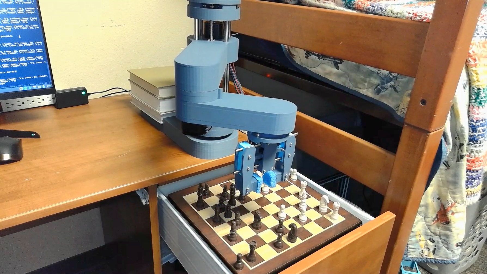
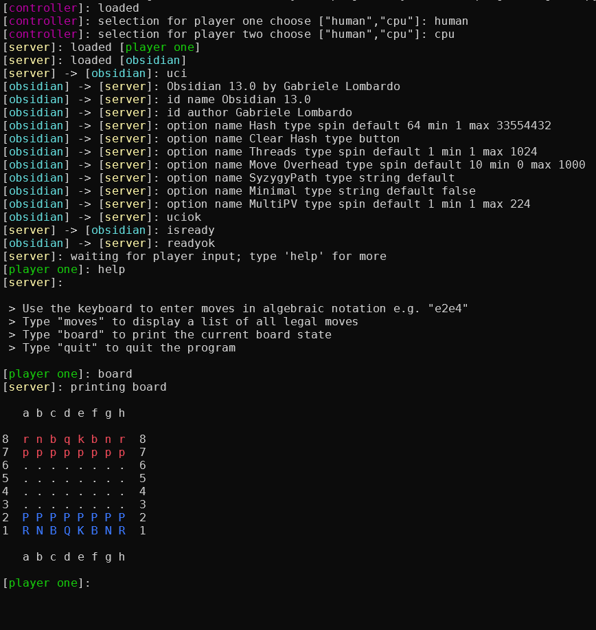
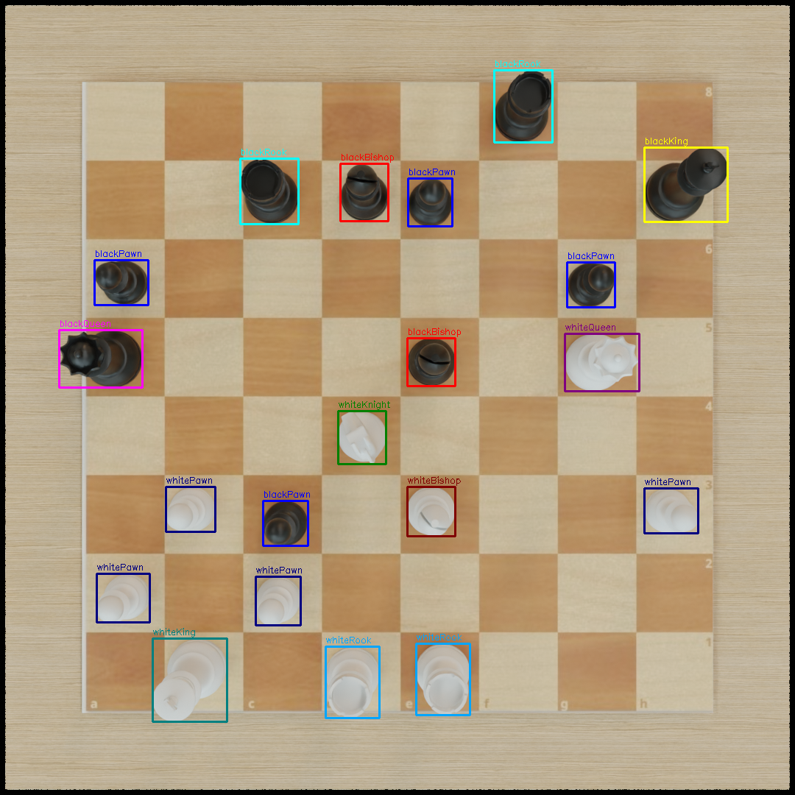
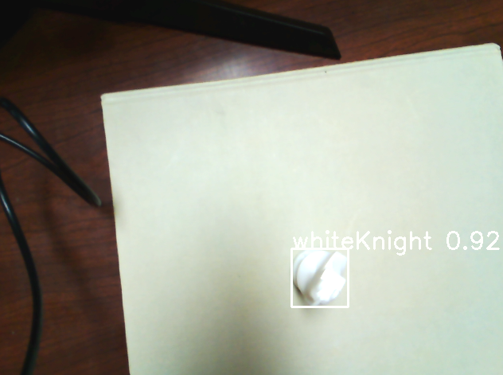
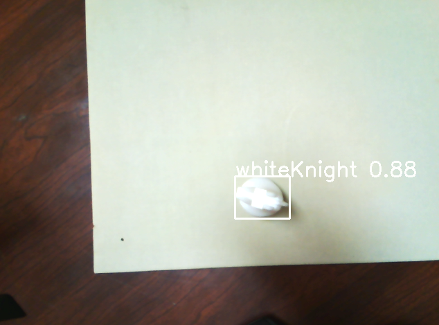

# Project Rhythm

## Chess Robotic Arm
A SCARA robot that is capable of playing chess!
## 

## Description

Project Rhythm is a command line program that allows two players (human or cpu) to play against each other using a SCARA (Selective Compliance Assembly Robot Arm) on a physical board. Moves are entered either by the user via a keyboard in the command line or by parsing out move information from the UCI protocol commands. They are then broken down into a list of tasks for the SCARA to complete. It supports almost every possible situation, although there are a few (particular involving extensive promotions or under-promotions) where the program may break. 

## Features

**Command Line Interface**: Interface with the program by typing commands into a command line with a keyboard. All output is color-coded to make reading easier. Type quit or use the keyboard interrupt ctrl + c to quit at anytime.

**Muli-User Support**: Play human vs. human, human vs. cpu, or cpu vs. cpu by selecting human or cpu for the players on program start. 

**Rich Information**: View extensive amounts of information about what is happening behind the scenes with the chess UCI protocols as well as the commands being sent to and from the controller, server, and SCARA

## Running

To run the program, simply download the project folder on both the display machine and the Raspberry Pi and store it somewhere in the file system. Be sure the folder you put it in includes both /src and /assets. Navigate to the root on the Pi in the command line and run ```python main_rpi.py``` to begin broadcasting to the display. On the display machine, again navigate to the root in the command line, but this time run ```python main_display.py```. Enter ```human``` or ```cpu``` for players. If you select ```human```, type ```help``` for more information on commands and functions. On the first move, the Raspberry Pi will ask you to confirm calibration by entering ```y```. 

## Example Run



## Project Expansion

This project was initially designed to work with a camera using object detection trained on synthetic 3D renders from a blender script I wrote. The camera would have been built into the end of the arm allowing for real time position information and the elimination of a CLI for a seamless experience.

While the object detection was able to successfully identify a piece, the refresh rate, resolution quality, and limited processing power on the Raspberry Pi 4B the SCARA runs on made implementing this in a 15 week timeframe far too complex. Creating the full dataset required learning bpy for blender scripting as well as over 48 hours of non-stop rendering. Training the model on the results could have taken multiple days or even a whole week given my lackluster cpu. 

If you are interested, you can review ```synthetic_data.py``` to see my blender script and the images below for some of the results. I hope to more fully implement this feature as I continue to expand my chess related programming experience.





## Contributing

Contributions are welcome! Feel free to open issues or submit pull requests. This is an active project that is receiving regular updates. 
